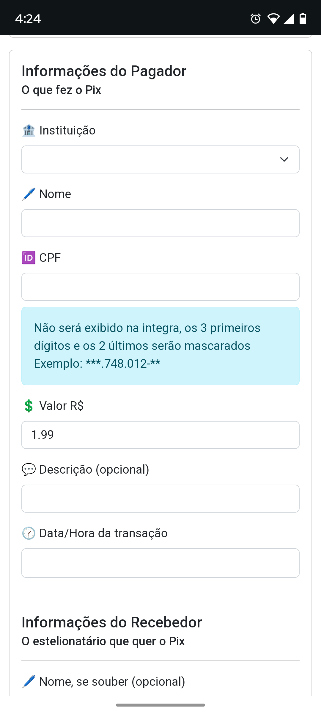
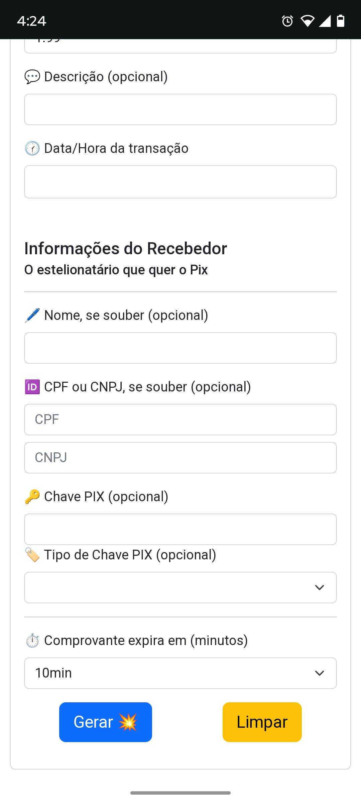
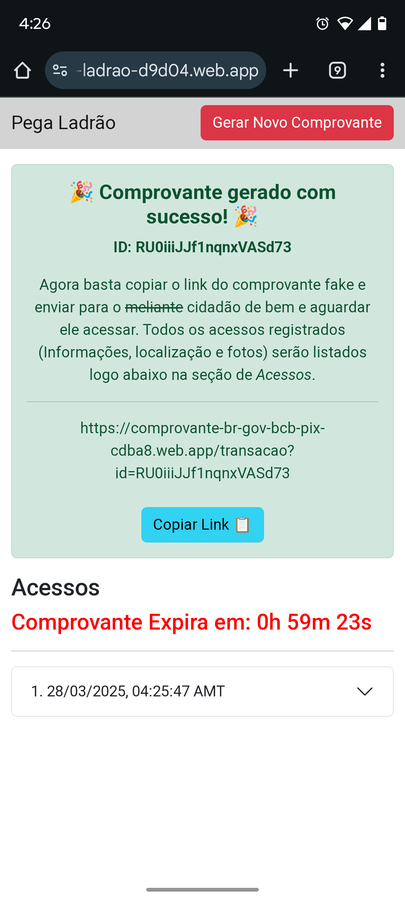
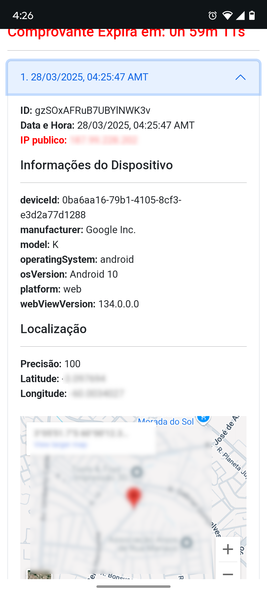
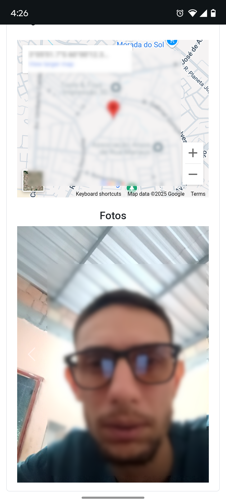

# Pega Ladrão

Aplicação criada para apoiar vítimas de golpe, ameaça ou tentativa de extorsão. A ideia é gerar um comprovante Pix temporário, enviar o link ao golpista e acompanhar os acessos, registrando evidências técnicas quando o visitante aciona essa opção no comprovante.

O projeto foi inspirado por iniciativas como o Backscan, mas usa Firebase como base. Ele pode registrar acessos, IP, dados de dispositivo, localização e imagem quando o fluxo de evidências é acionado e as permissões do navegador são concedidas.

> **Aviso de responsabilidade:** use apenas em situações legítimas, respeitando consentimento, privacidade e legislação aplicável. O mau uso deste software é responsabilidade de quem o opera.

## Para Usuários Da Versão Pública

Use esta seção se você só quer usar a aplicação já publicada no Firebase deste projeto.

### Endereços

- Gerar e acompanhar comprovantes: https://pega-ladrao-d9d04.web.app/_gerar
- Link base do comprovante enviado ao destinatário: https://comprovante-br-gov-bcb-pix-cdba8.web.app

### Passo A Passo

1. Acesse https://pega-ladrao-d9d04.web.app/_gerar.

   
   

2. Preencha os dados do pagador, do recebedor e o tempo de expiração.

3. Clique em **Gerar**. Se tudo estiver correto, você será redirecionado para a página de acessos, parecida com `/acessos?id=<ID>`.

   

4. Na página de acessos, copie o link público do comprovante. O link usa o domínio `https://comprovante-br-gov-bcb-pix-cdba8.web.app` e segue o formato `/transacao?id=<ID>`.

5. Envie esse link ao destinatário. Quando ele abrir o comprovante, o acesso básico aparece no painel. Se ele acionar o botão de evidências e conceder permissões, o painel poderá mostrar IP, dispositivo, localização e foto.

   
   

A página de acessos atualiza periodicamente. Mantenha o link `/acessos?id=<ID>` salvo enquanto o comprovante estiver válido.

## Para Desenvolvedores

Use esta seção se você quer rodar localmente ou publicar sua própria instância Firebase.

### Requisitos

- Node.js 22 ou compatível.
- NPM.
- Projeto Firebase com Firestore, Storage, Hosting e Authentication Anonymous habilitados.
- Java disponível para executar os emuladores Firebase em `npm run test:rules`.

### Configuração Local

1. Instale as dependências:

   ```bash
   npm install
   ```

2. Crie o arquivo `.env.local` a partir de `.env.example`:

   ```bash
   cp .env.example .env.local
   ```

3. Preencha as variáveis Firebase:

   - `VITE_FB_API_KEY`
   - `VITE_FB_AUTH_DOMAIN`
   - `VITE_FB_PROJECT_ID`
   - `VITE_FB_STORAGE_BUCKET`
   - `VITE_FB_MESSAGING_SENDER_ID`
   - `VITE_FB_APP_ID`
   - `VITE_DEFAULT_COMPROVANTE_URL`

Não commite `.env.local`.

### Comandos

- `npm run dev`: inicia o servidor local de desenvolvimento.
- `npm run build`: gera o build de produção em `dist/`.
- `npm run preview`: serve o build localmente.
- `npm run test:rules`: valida Firestore e Storage Rules no Firebase Emulator.
- `npm audit`: verifica vulnerabilidades de dependências.

### Firebase

Arquivos importantes:

- `firebase.json`
- `firestore.rules`
- `firestore.indexes.json`
- `storage.rules`

Antes de publicar, rode:

```bash
npm run build
npm audit
npm run test:rules
```

Publique regras, índices e hosting conforme seu projeto Firebase:

```bash
npx firebase-tools deploy --only firestore:rules,firestore:indexes,storage,hosting
```

### Segurança E SDD

- Leia `docs/security.md` antes de alterar coleta de evidências ou regras Firebase.
- As specs SDD ficam em `docs/sdd/`.
- Mudanças relevantes devem atualizar a spec correspondente e incluir verificação.

### Solução De Problemas

- Erro ao gerar comprovante: verifique `.env.local`, Authentication Anonymous e regras publicadas.
- Sem acessos no painel: publique `firestore.indexes.json` e confirme que abriu `/acessos` no mesmo navegador que gerou o comprovante.
- Fotos não aparecem: verifique Storage Rules e permissões de câmera no navegador.
- `npm run test:rules` falha por porta ocupada: ajuste as portas em `firebase.json` na seção `emulators`.
